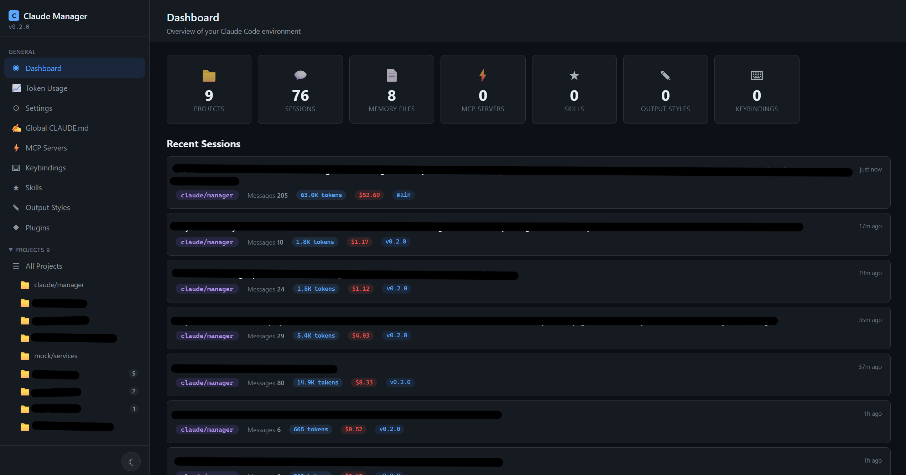
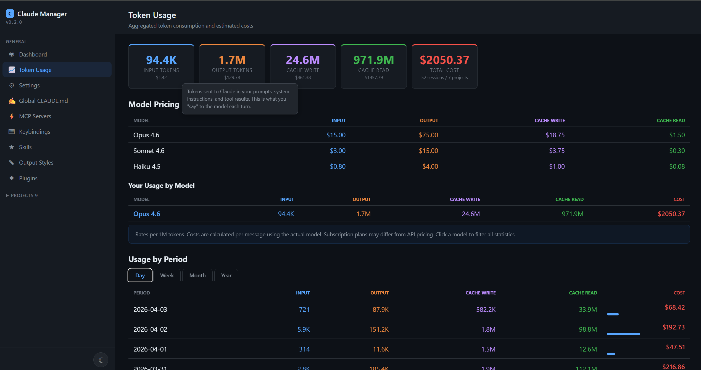

# Claude Manager

A local web UI for managing Claude Code configuration — settings, memory, MCP servers, keybindings, skills, output styles, sessions, token usage, and more.

Runs entirely on your machine. No cloud, no accounts, no external dependencies beyond Node.js.

## Quick Start

**macOS / Linux / Git Bash on Windows:**
```bash
./run.sh 1
```

**Windows (Command Prompt / PowerShell):**
```cmd
run.bat 1
```

The script will install Node.js if missing, install dependencies, and open the app in your browser automatically.

> **Run natively, not in Docker.** A Docker image is available, but running it hides key features: the in-page terminal, OS terminal launch, and open-in-explorer are all disabled inside a container. Use the run scripts above for the full experience.

## Requirements

- Claude Code installed (`~/.claude/` directory must exist)
- Node.js 18+ (auto-installed by the run script if missing)

## What It Manages

| Feature | Config File | Actions |
|---------|-------------|---------|
| **Dashboard** | — | Overview: recent sessions, usage summary, quick links |
| **Token Usage** | `data/usage-index.json` | Aggregated stats, cost estimates, period/project breakdowns, charts |
| **Settings** | `~/.claude/settings.json` | Visual tree editor + raw JSON + inline reference panel |
| **CLAUDE.md** | `~/.claude/CLAUDE.md` | Markdown editor with live preview |
| **MCP Servers (user scope)** | `~/.claude.json` → `mcpServers` | Add, edit, enable/disable, delete — available across all projects |
| **Cloud Integrations** | `~/.claude/.credentials.json` (read-only) | View OAuth-connected services (Atlassian, etc.) |
| **Keybindings** | `~/.claude/keybindings.json` | Add contexts, map key combos to actions |
| **Skills** | `~/.claude/skills/*/SKILL.md` | Create, edit, delete custom slash commands |
| **Output Styles** | `~/.claude/output-styles/*.md` | Create, edit, delete response presets |
| **Plugins** | `~/.claude/plugins/` | View marketplaces and blocklist (read-only) |
| **Project Memory** | `~/.claude/projects/*/memory/` | CRUD memory files with frontmatter editor, export/import as ZIP |
| **Sessions** | `~/.claude/projects/*/` | Browse history, rename, search messages, view conversation with tool-use display, in-page terminal |
| **Project Settings** | `.claude/settings.local.json`, `.claude/settings.json` | Edit local and shared project permissions |
| **Project MCP (project scope)** | `<project>/.mcp.json` | Project-level MCP server config (checked into git) |
| **Project MCP (local scope)** | `~/.claude.json` → `projects["<path>"].mcpServers` | Per-project, per-user MCP server config |
| **Project Agents** | `.claude/agents/*.md` | Create, edit, delete custom subagents |
| **Project Skills** | `.claude/skills/*/SKILL.md` | Project-scoped custom slash commands |
| **Project Output Styles** | `.claude/output-styles/*.md` | Project-scoped response presets |
| **Manager Settings** | `data/` | Pricing fetch URL, pricing history, manual model pricing editor |

### MCP scopes

Claude Code supports three MCP scopes; Claude Manager shows all of them in the matching location Claude Code itself uses, so what you see in the UI matches what `claude mcp list` reports:

- **User scope** (`claude mcp add --scope user`) → `~/.claude.json` → `mcpServers` — visible on the global **MCP Servers** page.
- **Project scope** (`claude mcp add --scope project`) → `<project>/.mcp.json` at the project root (checked into git) — visible inside a project's **MCP** tab.
- **Local scope** (`claude mcp add --scope local`, the default) → `~/.claude.json` → `projects["<project path>"].mcpServers` — visible inside a project's **MCP** tab alongside project scope.

## Highlighted Features

### Token Usage & Charts
Tracks all token consumption and estimated costs across every session. Charts show cost and token trends over time, cost by model, and top projects by spend. Pricing is fetched from Anthropic automatically on startup and kept in a history log so historical cost calculations stay accurate.

### In-Session Terminal
An embedded xterm.js terminal panel lives inside the session detail view — open a shell in the project directory without leaving the browser. Clipboard shortcuts (Ctrl+C/V) work, the pane is resizable, and state persists across page refreshes.

### Session Conversation
Full conversation replay with structured tool-use display: `Edit` renders a before/after diff, `Bash` shows the command in a code block, and other tools (Read, Write, Glob, Grep, Agent, WebFetch…) each have a tailored compact view. User messages, assistant responses, and tool calls all render with syntax highlighting.

### Session Search
Full-text search across all messages in a project — covers user messages, assistant responses, tool calls, and tool results — with context snippets and match highlighting.

### Themes
Four built-in themes: Dark, Light, Matrix, and Default (Catppuccin). Cycle through them via the sidebar button.

## Custom Skills

This project includes a `/p-run` skill to start the development server.

## Architecture

```
server.js          # Express entry point
lib/               # Shared server helpers
  paths.js         # Path constants
  file-helpers.js  # File I/O: backup, readJson, validation
  slug.js          # Project slug <-> filesystem path decoder
  frontmatter.js   # YAML frontmatter read/write helpers
  usage-index.js   # Token usage indexer and aggregation
routes/            # Express route modules (13 files)
data/              # App-local storage (gitignored, never in ~/.claude/)
public/
  index.html       # SPA shell
  css/style.css    # Dark/light theme
  js/
    utils.js       # Shared client utilities + constants
    modal.js       # Modal dialog factory
    app.js         # Navigation and routing
    [feature].js   # One file per UI feature
```

**Stack**: Express + vanilla JS. npm dependencies: `express`, `gray-matter`, `node-pty`, `ws`, `adm-zip`. No build step, no TypeScript, no framework.

## Cross-Platform

Works on Windows, macOS, and Linux. Path resolution handles all OS conventions automatically.

## Security

- Server binds to `127.0.0.1` only — never exposed to the network
- All file writes create a backup first
- Path traversal is prevented on all endpoints
- No credentials or secrets are ever written — only read for display

## Changelog

See [CHANGELOG.md](CHANGELOG.md) for release notes.

## Screenshots

### Dashboard


### Token Usage

